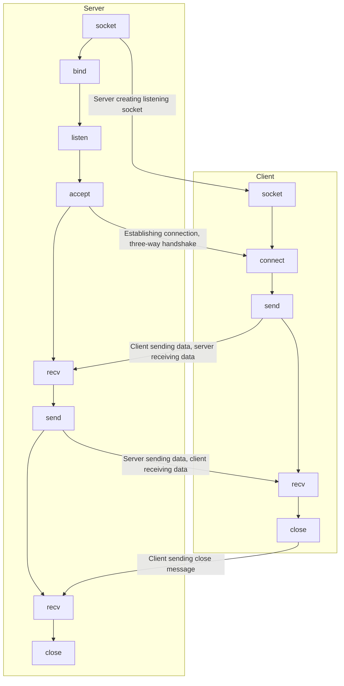

# CANBus Notebook: A Practical Guide for Embedded Systems 🚀

---

## Table of Contents

1.  [Introduction to CANBus & Roadmap](#introduction-to-canbus--roadmap)
2.  [Linux Commands Reference](#linux-commands-reference)
3.  [CANBus Communication Examples (Python)](#canbus-communication-examples-python)
    * [Exercise 1: Receiving CAN Messages from LOHR Inclinometer](#exercise-1-receiving-can-messages-from-lohr-inclinometer)
    * [Exercise 2: Controlling LEDs via CAN Message from Server](#exercise-2-controlling-leds-via-can-message-from-server)
    * [Exercise 3: CAN Data Filtering and LED Control with Inclinometer](#exercise-3-can-data-filtering-and-led-control-with-inclinometer)
4.  [Ethernet Communication Examples (Python)](#ethernet-communication-examples-python)
    * [Exercise 4: Ethernet Data Transfer - Raspberry Pi to PC](#exercise-4-ethernet-data-transfer---raspberry-pi-to-pc)
    * [How Data is Transferred Over Ethernet?](#how-data-is-transferred-over-ethernet)
5.  [CAN & Ethernet Integration](#can--ethernet-integration)
    * [Exercise 5: Receiving CAN and Sending Data via Ethernet](#exercise-5-receiving-can-and-sending-data-via-ethernet)
6.  [Concurrency in Python: Threads vs. Multiprocessing](#concurrency-in-python-threads-vs-multiprocessing)
7.  [C++ Implementations](#c-implementations)
    * [CAN-Ethernet Server (C++)](#can-ethernet-server-c)
    * [CAN-Ethernet Client (C++)](#can-ethernet-client-c)
    * [PowerShell Commands for C++ Execution](#powershell-commands-for-c-execution)
8.  [Memory Management in C/C++](#memory-management-in-cc)
9.  [References & Bibliography](#references--bibliography)

---

## 1. Introduction to CANBus & Roadmap

This notebook outlines a roadmap for understanding and implementing various communication interfaces and programming concepts crucial for embedded systems development.

### Roadmap Overview:

| Category        | Sub-categories                                  |
| :-------------- | :---------------------------------------------- |
| **Interfaces** | GPIO (LEDs, Inputs/Outputs)                     |
|                 | Serial (RS232) - `/dev/serial0`                 |
|                 | CAN - `iface can0`, `iface can1`                |
|                 | Ethernet - `eth0`                               |
|                 | Wi-Fi - `wlan0`                                 |
| **Routines** | Classes                                         |
|                 | Threads                                         |
| **Customizations** | Tabela                                         |
|                 | `addcan`                                        |

---

## 2. Linux Commands Reference

A quick reference for essential Linux commands used in this notebook:

* **`ls`**: Lists all files in the directory.
* **`df`**: Shows the amount of used space on the hard drive.
* **`top`**: Shows memory usage.
* **`cd`**: Changes the current directory (e.g., `cd directory`, `cd ..`, `cd /`).
* **`mkdir`**: Creates a directory.
* **`rm`**: Removes a file/directory.
* **`cat`**: Opens a file (showing content in the console).
* **`gip`**: Get IP.
* **`ssh`**: Secure Shell, allows logging into a remote server.
* **`passwd`**: Changes the password for the logged-in user.
* **`mv`**: Moves or renames files or directories.
* **`netstat`**: Shows the network status.
* **`ifconfig`**: Displays machine IP addresses and related network functions.
* **`ping`**: Pings a host to measure response times.
* **`^y`**: Suspends the process on the next input request.
* **`^z`**: Suspends the current process.
* **`history`**: Lists the last used commands.

---

## 3. CANBus Communication Examples (Python)

These exercises demonstrate CANBus communication using `python-can` library on a Raspberry Pi (or similar embedded Linux system). The actual Python code for these exercises is located in separate `.py` files within this repository.

### Exercise 1: Receiving CAN Messages from LOHR Inclinometer (01_receive_show_CANdata.py)

This exercise focuses on setting up a CAN interface and passively listening for incoming CAN messages from a LOHR inclinometer. The system initializes a CAN bus, then enters a loop to receive messages with a timeout. If a message is received, its timestamp, arbitration ID, data length code (DLC), and payload bytes are extracted and printed to the console. This demonstrates basic CAN message reception and parsing.

**Example output format:**
`
Ready
entrou
recebeu mensagem
1695912689.235215 cf013a2 8 23 7 8 7e ff ff 0 28
entrou
recebeu mensagem
1695912689.254719 cf013a2 8 21 7e ff 7d ff ff 28
`

### Exercise 2: Controlling LEDs via CAN Message from Server (02_led_manipulation_CAN.py)

This exercise demonstrates active CAN communication by both sending and receiving messages to control LEDs connected to GPIO pins on a Raspberry Pi. The system initializes two CAN interfaces (`can0` and `can1`). One thread (`can_rx_task`) continuously monitors `can1` for incoming messages. Based on the data in received messages (specifically the first byte), an LED (`LED_C1`) is turned on or off. Concurrently, the main loop sends periodic CAN messages from `can0` with a predefined arbitration ID and data, toggling another LED (`LED_C0`) to indicate transmission. This highlights simultaneous\ send/receive operations and basic external control via CAN.

### Exercise 3: CAN Data Filtering and LED Control with Inclinometer (03_receive_send_CANdata.py)

Building on previous exercises, this scenario involves connecting an inclinometer and a second CAN device. The primary goal is to receive data from both on `can1`, filter these messages by their arbitration ID, and then command three different LEDs. Two LEDs (`LED_C0` and `LED_C1`) are controlled based on the values of specific bytes from one CAN message (identified by `ID_CAN0`). A third LED (`LED_SS`) is commanded based on calculated pitch and roll values derived from the inclinometer's data (identified by `ID_INCLINOMETRO`), turning on if either pitch or roll exceeds a defined threshold. This exercise demonstrates message filtering, data interpretation, and conditional GPIO control.

**Note:** The original notebook mentions that using `time.sleep()` in the main loop can hinder the reception of other CAN messages. For more responsive systems, event-driven programming or asynchronous patterns are generally preferred to avoid blocking operations.

---

## 4. Ethernet Communication Examples (Python)

These exercises focus on establishing basic client-server communication over Ethernet using Python sockets. The actual Python code for these exercises is located in separate `.py` files within this repository (e.g., `server.py`, `client.py`).

### Exercise 4: Ethernet Data Transfer - Raspberry Pi to PC (04_data_through_ethernet.py)

This exercise demonstrates a simple UDP (User Datagram Protocol) client-server interaction over Ethernet.
The **Python Server** (intended to run on the Raspberry Pi) binds to a specific IP address and port, listens for incoming UDP messages from a client, processes commands like 'INC' (increment) or 'DEC' (decrement) for a counter, and sends the updated counter value back to the client.
The **Python Client** (intended to run on a PC) prompts the user for commands ('INC' or 'DEC'), sends these commands as UDP messages to the server, and then receives and prints the server's response. This showcases fundamental UDP socket programming for simple data exchange.

### How Data is Transferred Over Ethernet?

Data transfer over Ethernet occurs bit by bit, leveraging rapid voltage changes to achieve high speeds (gigabits per second).
When transferring a number, it's converted to its ASCII equivalent, then to binary. The bits are then sent as extremely fast electrical pulses.
Protocols define the rules for data transfer, including bit order and header format, ensuring both sender and receiver understand the communication.
Headers are crucial for directing data to the correct destination, containing source and destination addresses, and other packet management information. The destination IP address can change as the packet moves through a network of routers.

**Server-Client Interaction Flow (TCP - for conceptual understanding, often applies to UDP's logical flow):**


** Server Configuration Example:
- Raspberry Pi 4-IP: 192.168.49.89 (Example)
- Behavior: Receives client requests and sends the desired response.

** Client Configuration Example:
- PC-IP: 192.168.49.20 (Example)
- Behavior: Sends requests to the Server and receives responses.

## 5. CAN & Ethernet Integration

### Exercise 5: Receiving CAN and Sending Data via Ethernet (05_receive_send_ethernet_server.cpp / 05_receive_send_ethernet_client.cpp)

This exercise outlines the conceptual behavior for integrating CAN and Ethernet communication, acting as a bridge between the two protocols. The actual C++ code for this exercise is located in separate `.cpp` files within this repository (e.g., `can-eth.cpp`, `client-server-2.cpp`).

**Raspberry Pi 4 Behavior (Server):**
The Raspberry Pi acts as a server, continuously performing two main tasks:
1.  **CAN Reception**: It constantly receives incoming messages from both `can0` and `can1` interfaces.
2.  **Client Request Check**: It monitors for any incoming requests from the PC Client over Ethernet.
If a request is received from the PC Client, the server activates a mechanism to send the next CAN data frame that corresponds to the client's specific request. If no client request is pending, the server continues its regular CAN message processing.

**PC Behavior (Client):**
The PC acts as a client, operating in a repetitive loop:
1.  **User Prompt**: It asks the user if they wish to make a data request.
2.  **Request Handling**:
    * If the user agrees, the client sends the data request to the Raspberry Pi server over Ethernet.
    * It then waits for and receives the response from the server, subsequently printing the received data.
3.  **Loop Continuation**: After completing a request (or if the user initially declined), the client returns to the beginning of the loop, prompting the user for another action.

---

## 6. Concurrency in Python: Threads vs. Multiprocessing

This section discusses different approaches to concurrency in Python, highlighting the trade-offs between threads and multiprocessing, and introducing other relevant modules.

### Threads

* **When suitable**: Threads are generally well-suited for **I/O-bound tasks**, where the program spends a significant amount of time waiting for external operations (like network requests, file I/O, or user input).
* **Memory**: Threads within the same process share the same memory space, making data sharing straightforward but requiring careful synchronization.
* **Considerations**:
    * **Global Interpreter Lock (GIL)**: In CPython (the most common Python interpreter), the GIL prevents multiple threads from executing Python bytecode concurrently, meaning threads are not ideal for **CPU-bound tasks** (tasks that spend most of their time performing calculations).
    * **Processing Overhead**: Each time a thread is managed or switched, there's some processing overhead.
    * **Memory Management**: Memory designation and reclamation occur for each thread.
    * **"Orphan Threads"**: If threads are not properly managed and shut down, they can become "orphan threads," continuing to consume CPU time and resources unnecessarily.

### Multiprocessing

* **When ideal**: Multiprocessing is ideal for **CPU-bound tasks** as it leverages multiple CPU cores by running separate processes.
* **Memory**: Each process has its own isolated memory space, which avoids GIL limitations for true parallelism but makes data sharing between processes more complex (requiring explicit inter-process communication mechanisms).

#### Queues (First-In, First-Out - FIFO)

* **Benefits**: Queues provide a robust and easy way to run both synchronous and asynchronous tasks, particularly useful in multiprocessing or multithreading scenarios. They are designed to prevent common concurrency issues like "race conditions" and "deadlocks" by managing data flow in a structured (FIFO) manner.
* **Cost**: They generally incur less processing and memory overhead compared to direct thread management for complex coordination.

#### Multiprocessing Components:

* **Process**: A class used to execute a function across multiple values in parallel, facilitating data parallelism.
* **Lock**: A mutual exclusion (mutex) lock is a synchronization primitive intended to prevent race conditions by ensuring only one thread/process can access a shared resource at a time.
* **Queue**: An object that is thread and process safe, implementing a FIFO (First-In, First-Out) data structure for inter-process or inter-thread communication.
* **Pool**: An object to control a set of worker processes, often via a parallel map implementation, for distributing tasks across multiple CPU cores.

#### Other Python Concurrency Modules:

* **`concurrent.futures`**: Provides a high-level interface for concurrent execution using either threads or processes. It abstracts away many complexities of manually managing threads or processes, offering a simpler way to run tasks concurrently.
* **`asyncio`**: A library for asynchronous programming, designed to handle many concurrent I/O operations efficiently using a single thread. It leverages coroutines and an event loop to manage tasks that involve waiting for external events, rather than CPU-intensive computations.

---

## 7. C++ Implementations

This section provides a conceptual overview of the C++ implementations for a CAN-Ethernet server and client, demonstrating advanced socket communication, CAN frame handling, and concurrency using C++ threads. The actual C++ source code files (`can-eth.cpp` for the server and `client-server-2.cpp` for the client) are provided separately in this repository.

### CAN-Ethernet Server (C++)

This C++ server application is designed to run in an embedded Linux environment (like a Raspberry Pi). Its primary function is to act as a gateway between CAN bus communication and Ethernet-based client requests.
* **CAN Interface Initialization**: It initializes specified CAN interfaces (e.g., `can0`, `can1`) to send and receive CAN frames.
* **Concurrency**: It utilizes C++ `std::thread` to manage concurrent operations:
    * One thread continuously `receiveCANFrame` from a designated CAN bus.
    * Another thread periodically `sendCANFrame` to a CAN bus with example data.
    * Dedicated threads are spawned via `handleClient` to manage individual client connections over TCP.
* **TCP Server Setup**: It establishes a TCP server socket, binds it to a specific port (e.g., 8888), and listens for incoming client connections.
* **Client Handling**: For each connected client, a separate thread is detached to `handleClient` requests. The server expects the client to send a specific CAN ID (as `uint32_t`). Once this ID is received, the server attempts to find a matching CAN frame it has recently received and sends that frame back to the client. A retry mechanism is implemented to wait for the desired CAN frame to arrive if it's not immediately available.
* **Resource Management**: It includes mechanisms for graceful shutdown, closing sockets and joining threads upon program termination.

### CAN-Ethernet Client (C++)

This C++ client application is designed to run on a PC (demonstrated with Windows using `WinSock2.h`). Its purpose is to connect to the C++ CAN-Ethernet server, request specific CAN frame data by its ID, and receive the corresponding frame.
* **Winsock Initialization (Windows)**: On Windows, `WSAStartup` is called to initialize the Winsock library.
* **TCP Client Setup**: It creates a TCP client socket and attempts to `connect` to the server's IP address and port.
* **CAN ID Request**: The client prompts the user to enter a CAN ID (in hexadecimal) that they wish to receive from the server. This requested ID is then sent to the server.
* **Response Reception**: The client enters a loop to `recv` incoming data from the server. It expects to receive a full `can_frame` structure. If a frame is received, it checks if its `can_id` matches the ID that was requested. If it matches, the data is printed; otherwise, it indicates that a different frame was received. A retry mechanism is included to allow the client to wait for the correct frame.
* **User Control**: After each request, the client asks the user if they want to continue, allowing for multiple requests within the same session.
* **Resource Cleanup**: `closesocket` (or `close` on Linux) and `WSACleanup` (on Windows) are called to release network resources.

### PowerShell Commands for C++ Execution

These commands illustrate how to compile and run the C++ server and client applications using PowerShell, relevant for managing the embedded Linux server and the Windows client.

**For Server (on Raspberry Pi/Linux environment via SSH):**
```powershell
PS C:\Users\julia_peyerl> ssh nuc@10.41.17.89 # Connect via SSH to the server
nuc@10.41.17.89's password: # Enter password

# Once connected to the Linux terminal:
nuc:~ $ cd C++/new # Navigate to the directory containing the source code
nuc:~/C++/new $ g++ -o can-eth can-eth.cpp -lpthread # Compile the C++ code, linking with pthreads library
nuc:~/C++/new $ ./can-eth # Execute the compiled program

For Client (on PC with PowerShell):

```powerShell
PS C:\Users\julia_peyerl> cd C:\Users\julia_peyerl\Documents\try # Navigate to the client source code directory
PS C:\Users\julia_peyerl\Documents\try> g++ -o client-server.exe client-server-2.cpp -lws2_32 # Compile for Windows, linking with WinSock2 library
PS C:\Users\julia_peyerl\Documents\try> .\client-server.exe # Execute the client program
Enter IDCAN (in hexadecimal): # Prompt to enter CAN ID

````markdown
## 8. Memory Management in C/C++

Memory management is a fundamental concept in C/C++, particularly when dealing with pointers and dynamic allocation, enabling fine-grained control over memory usage.

**Memory Segments of a Running Process:**
A program in execution occupies distinct logical memory segments:

* **Text (Code)**: Contains the compiled program's instructions and constant values. This segment is typically read-only and has a fixed size throughout the process's lifetime.
* **Data**: Stores global and static variables. This segment is generally allocated at program startup and maintains a fixed size.
* **Stack**: This is a region of memory used for local variables, function parameters, and return addresses during function calls. It operates on a LIFO (Last-In, First-Out) principle and dynamically grows and shrinks with function invocations and returns.
* **Heap**: This segment is used for dynamic memory allocation, where memory blocks are explicitly requested by the program during its runtime. Its size can vary significantly as the program executes, allowing for flexible memory allocation as needed.

```mermaid
graph TD
    start_0[0] --> Text
    Text --> Data
    Data --> Heap
    Heap -- "Growing Up" --> Unallocated[área não alocada]
    Stack -- "Growing Down" --> Unallocated
    Unallocated --> max_addr[max]
````

**Types of Memory Allocation in C:**
C offers three primary ways to allocate memory:

  * **Static Allocation**: Occurs for global variables or variables declared with the `static` keyword. Memory is allocated in the `Data` segment at compile time, and its lifetime is for the entire duration of the program.
  * **Automatic Allocation**: Happens for local variables and function parameters. Memory is allocated on the `Stack` when a function is called and automatically deallocated when the function returns.
  * **Dynamic Allocation**: This is when the program explicitly requests a block of memory from the operating system (typically from the `Heap`) at runtime. The programmer is responsible for managing this allocated memory, including explicitly freeing it when it's no longer needed to prevent memory leaks. This is essential for scenarios where the amount of data is unknown until the program is running (e.g., handling user input of arbitrary length).

**Pointers in C/C++:**
Pointers are variables that store memory addresses. C/C++ provides operators to manipulate them:

  * **`&` (address-of operator)**: Returns the memory address of a variable. For example, `&myVar` gives the memory location of `myVar`.
  * **`*` (dereference operator)**: Accesses the value stored at the memory address pointed to by a pointer. For example, `*ptr` gives the value at the address stored in `ptr`.

When pointers point to aggregate data types like structs or classes, members can be accessed in two ways:

  * Using the `*` (dereference) operator: `(*ptr).field_name` (first dereference the pointer, then access the member).
  * Using the `->` (arrow) operator): `ptr->field_name` (a syntactic shortcut for the above, commonly used for pointer-to-member access).

**Common Pointer-Related Issues:**

  * **Dangling Pointers**: A pointer that refers to a memory location that has already been freed or deallocated. Using a dangling pointer leads to undefined behavior, as the memory might have been reallocated for another purpose.
    ```c++
    int *ptr = new int; // Allocate memory for an int
    delete ptr;         // Free the memory. ptr now points to invalid memory.
    *ptr = 2;           // Dereferencing a dangling pointer - dangerous!
    ```
  * **Memory Leaks (Lost Dynamic Variables)**: Occurs when dynamically allocated memory is no longer reachable by any active pointers in the program, but has not been deallocated. This memory remains reserved and unavailable for other uses until the program terminates, leading to inefficient resource utilization, especially in long-running applications.
    ```c++
    int *ptr1 = new int; // Allocate memory block A
    int *ptr2 = new int; // Allocate memory block B
    ptr1 = ptr2;         // ptr1 now points to memory block B.
                         // The memory block A, originally pointed to by ptr1, is now lost
                         // because no pointers refer to it, and it hasn't been deleted.
    ```

-----

## 9\. References & Bibliography

  * [Installing python-can on the Raspberry Pi](https://copperhilltech.com/blog/installing-pythoncan-on-the-raspberry-pi/)
  * [PiCAN-Python-examples - cluster rpm.py](https://www.google.com/search?q=https://github.com/skpang/PiCAN-Python-examples/blob/master/cluster%2520rpm.py)
  * [PiCAN-Python-examples - simple\_rx\_test.py](https://github.com/skpang/PiCAN-Python-examples/blob/master/simple_rx_test.py)
  * [Comandos Importantes Linux](https://www.devmedia.com.br/comandos-importantes-linux/23893)
  * [Linux kill process example](https://gist.github.com/iximiuz/fe49427ac6900f2a590629500981e5ab)
  * [Entenda as formas de transmissão de dados através da internet](https://www.dio.me/articles/entenda-as-formas-de-transmissao-de-dados-atraves-da-internet)
  * [Video: Sockets in Python](https://www.youtube.com/watch?v=S7Yle8clJ30)
  * [Real Python: Python Sockets](https://realpython.com/python-sockets/)
  * [How to Manage Threads in Python](https://www.activestate.com/blog/how-to-manage-threads-in-python/)
  * [Multiprocessing Queue in Python](https://www.google.com/search?q=https://superfastpython.com/multiprocessing-queue-in-python/%23Need%2520for%2520a%2520Queue)
  * [Linux kill process](https://pimylifeup.com/linux-kill-process/)
  * [Node.js Raspberry Pi Web Server with WebSocket](https://www.w3schools.com/nodejs/nodejs_raspberrypi_webserver_websocket.asp)
  * [Embedded Engineering Roadmap](https://github.com/m3y54m/Embedded-Engineering-Roadmap)

-----

**Connect with me\!**

I'm always looking for new challenges and opportunities in the embedded systems space. Let's connect on [LinkedIn](https://www.google.com/search?q=https://www.linkedin.com/in/juliaprokofiev/) or explore my other projects on [GitHub](https://github.com/JuliaProkofiev)\! Your feedback and insights are highly valued as I continue to learn and grow in this exciting field.

-----

```
```
